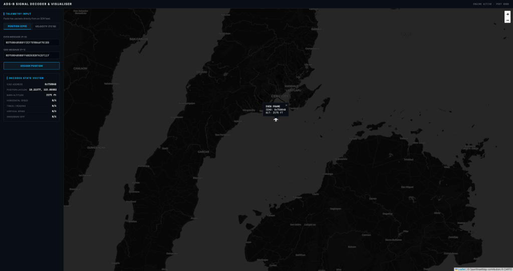

# Mode S ADS-B Message Parser & CPR/Velocity Decoder

A high-fidelity Python implementation for parsing and decoding 1090 MHz Mode S Extended Squitter (ADS-B) messages. This repository contains modules for CRC validation, spatial decoding using the Compact Position Reporting (CPR) algorithm, and vector velocity decomposition.

### [**Live Visualiser Demo**](https://ads-b-signal-decoder-visualiser.vercel.app/)



*Interactive flight telemetry and map dashboard decoding real-time transponder signals.*

---

## 1. What is ADS-B and Why It Matters

**Automatic Dependent Surveillance–Broadcast (ADS-B)** is the cornerstone of modern global air traffic management, replacing legacy Cooperative Independent Surveillance (like Primary and Secondary Surveillance Radars) under the FAA's **NextGen** and Europe's **SESAR** initiatives.

* **Automatic:** Broadcasts periodically (typically at $1 \text{ Hz}$) without needing interrogation from ground stations or other aircraft.
* **Dependent:** Relies on onboard GNSS/GPS receivers and altimeters to compute state vector parameters.
* **Surveillance:** Provides accurate position, velocity, and status data for air traffic control (ATC) and Traffic Collision Avoidance Systems (TCAS/ACAS).
* **Broadcast:** Transmits data omnidirectionally over a RF carrier frequency of $1090 \text{ MHz}$ using Pulse Position Modulation (PPM) at $1 \text{ Mbps}$.

### Why It Matters
Compared to Secondary Surveillance Radar (SSR), which relies on a rotating antenna with update rates of 4 to 12 seconds, ADS-B provides continuous, highly accurate, and low-latency state vectors. It reduces airspace separation minimums, enables automated conflict detection, and allows aircraft equipped with **ADS-B In** to maintain local situational awareness of surrounding traffic directly in the cockpit.

---

## 2. Decoder Architecture & Capabilities

This project is structured into two main layers: a binary message parser and a geometric state decoder.

```
.
├── parser_adsb.py       # Mode S packet validation and bit slicing
├── decoder.py           # Coordinate reconstruction (CPR), altitude, and velocity decoding
├── test_parser.py       # Unit tests for packet slicing and CRC checks
└── test_decoder.py      # Unit tests for CPR, altitude, and velocity math
```

### A. Packet Parsing ([parser_adsb.py](parser_adsb.py))
This module extracts low-level fields from the 112-bit Extended Squitter frame:
* **Downlink Format (DF) Slicing:** Extracts bits 1-5 to identify the protocol format (typically DF 17 or DF 18).
* **ICAO Address Extraction:** Slices bits 9-32 representing the unique 24-bit aircraft transponder address.
* **Type Code (TC) Detection:** Slices bits 33-37 of the Message (ME) payload to determine the category of transponder data (e.g., Identification, Airborne Position, Airborne Velocity).
* **CRC Parity Validation:** Simulates a 24-bit feedback shift register to perform binary polynomial division (modulo-2 division). The generator polynomial used is:
  $$G(x) = x^{24} + x^{23} + x^{22} + x^{21} + x^{20} + x^{19} + x^{18} + x^{16} + x^{14} + x^{13} + x^{12} + x^{11} + x^{10} + x^3 + x^1 + 1$$
  *(Represented in hex as `0xFFF409` or `0x1FFF409` including the leading coefficient).*

### B. State Decoding ([decoder.py](decoder.py))
This module handles spatial and physical reconstruction of the telemetry:

* **Compact Position Reporting (CPR) Decoding:** Slices the 34 bits (17 bits for latitude, 17 bits for longitude) allocated in Airborne Position messages (TC 9-18).
  * **Global Decoding:** Reconstructs the absolute, globally unambiguous latitude and longitude from an **Even** (Format $F=0$) and an **Odd** (Format $F=1$) frame received within a 10-second window.
  * **Zone Transition Support ($NL$):** Implements the $NL(lat)$ function specifying the number of longitude zones at a given latitude to account for the convergence of meridians toward the poles.
* **Altitude Reconstruction:** Decodes the 12-bit altitude field. Supports:
  * **25-foot Resolution (Q-bit = 1):** Slices out the Q-bit, constructs an 11-bit integer $N$, and calculates: $\text{Altitude (ft)} = (N \times 25) - 1000$.
  * **100-foot Resolution (Q-bit = 0):** Decodes legacy 12-bit Gillham/Gray-coded transponder telemetry into altitude.
* **Airborne Velocity Decoding (TC 19):** Decodes subsonic and supersonic horizontal speed, heading, and vertical rates:
  * **Ground Speed (Subtypes 1 & 2):** Parses East-West and North-South signed vector components, returning Ground Speed ($v = \sqrt{V_{ew}^2 + V_{ns}^2}$) and Track Angle ($h = \text{atan2}(V_{ew}, V_{ns})$).
  * **Airspeed (Subtypes 3 & 4):** Extracts heading and Indicated Airspeed (IAS) or True Airspeed (TAS) directly.
  * **Vertical Rate:** Extracts climb/descent speed ($64 \text{ ft/min}$ resolution) and vertical source (Barometric vs. GNSS).

---

## 3. How to Run the Decoder and Tests

### Run the Demonstrations
Execute the main decoder module to parse sample transponder signals:
```bash
python3 decoder.py
```
This runs position and velocity calculations against verified test vectors.

To run the parser module independently on a custom hex message:
```bash
python3 parser_adsb.py 8D4840D6202CC371C32CE0576098
```

### Run the Automated Unit Test Suites
Execute the test suites to run mathematical validations against edge cases:
```bash
# Run CPR position, altitude, and velocity tests
python3 test_decoder.py

# Run CRC and packet parser tests
python3 test_parser.py
```

### Launch the Visualisation Dashboard
To run the interactive web interface, navigate to the project directory and run:
```bash
python3 visualiser.py
```
Then open [http://localhost:8080](http://localhost:8080) in your web browser.

---

## 4. Verification & Example Outputs

### Web Visualiser Dashboard in Action


### CPR Position Decoder Output
When running position decoding on a pair of Even/Odd messages from Cebu Pacific Air flight **RP-C3191** (Airbus A319):
* **Even Message:** `8D75804B580FF2CF7E9BA6F701D0`
* **Odd Message:**  `8D75804B580FF6B283EB7A157117`

```text
Decoded Global Position:
  - ICAO Address:       0x75804B
  - Type Code:          11
  - Even Frame Position: (10.215775, 123.888819)
  - Odd Frame Position:  (10.216214, 123.889129)
  - Even Frame Altitude: 2175 ft
  - Odd Frame Altitude:  2175 ft
  - Distance Moved:      Approx. 0.049 km north-south
```

### Airborne Velocity Decoder Output (Type Code 19)
When decoding Ground Speed (Subtype 1) and Airspeed (Subtype 3) test vectors:

* **Subtype 1 Ground Speed Message:** `8D75804B99006599200000000000`
```text
Decoding Subtype 1 (Ground Speed):
  - Subtype:            1
  - Speed Type:         Ground Speed
  - Speed Magnitude:    223.61 knots
  - Heading/Track:      153.43°
  - E-W component:      100.00 knots
  - N-S component:      -200.00 knots
```

* **Subtype 3 Airspeed Message:** `8D75804B9B0600A5A00000000000`
```text
Decoding Subtype 3 (Airspeed):
  - Subtype:            3
  - Speed Type:         True Airspeed
  - Speed Magnitude:    300.00 knots
  - Heading/Track:      180.00°
  - E-W component:      0.00 knots
  - N-S component:      -300.00 knots
```
